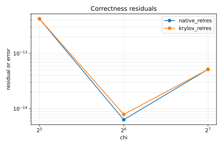

# KrylovKit.c

KrylovKit.c is a native CPU/CUDA backend for Krylov-style eigensolvers and
linear solvers. The Julia module name is `KrylovKitC`.

## Acknowledgement

KrylovKit.jl is the reference implementation and the semantic baseline for this
package. We are grateful to Jutho Haegeman and the KrylovKit.jl contributors for
the clear API and algorithmic design. This package is not a replacement for
KrylovKit.jl. It is a native backend intended for workloads where a C/CUDA ABI,
device-resident buffers, or specialized fast paths are useful.

If this code is useful in your work, please cite and acknowledge the original
KrylovKit.jl work by Jutho Haegeman and contributors. If you use it through
TeneT.c, please also cite and acknowledge TeneT.jl by Xingyu Zhang and
contributors. Please do not cite KrylovKit.c as the scientific source; this
repository is an engineering backend and benchmark artifact.

All public correctness tests and benchmarks should compare against KrylovKit.jl
unless a smaller LAPACK oracle is explicitly more appropriate.

## Release Scope

- `native_eigsolve(A_or_f, x0, howmany=1, which=:LM; ...)`
- `native_linsolve(A_or_f, b, x0=nothing, a0=0, a1=1; ...)`
- CPU `Float64` and `ComplexF64` correctness gates.
- CUDA correctness gates for supported device paths.
- MPS-like two-layer fast path used by TeneT.c.

The current implementation delegates to the existing native core in
`TenetNative`. The release-facing API is kept separate so downstream packages can
depend on KrylovKit.c without depending on TeneT.c.

## Basic Usage

```julia
using KrylovKitC

A = randn(128, 128)
x0 = randn(128)
vals, vecs, info = native_eigsolve(A, x0, 1, :LM; krylovdim=30, tol=1e-12)
```

Build or select the native shared library explicitly:

```julia
lib = build_native_krylov(target=:cpu)
vals, vecs, info = native_eigsolve(A, x0; lib)
```

## Performance

Release README figures are generated from raw benchmark artifacts, not edited by
hand. The measurements below use the release benchmark scripts with warmup 2 and
repeat 7.

CPU fallback run, local Apple Silicon, `run-2f2788a21035`, commit `4acd3aa`:

| chi | native median (s) | KrylovKit median (s) | speedup | native residual |
| ---: | ---: | ---: | ---: | ---: |
| 32 | 0.001561 | 0.001451 | 0.93x | 4.21e-13 |
| 64 | 0.009271 | 0.011164 | 1.20x | 6.35e-15 |
| 128 | 0.065306 | 0.082468 | 1.26x | 5.16e-14 |




H100 run, Snellius `gpu_h100`, `run-1d9b3b7f8834`, commit `f939992`:

| chi | native median (s) | KrylovKit median (s) | speedup | native residual |
| ---: | ---: | ---: | ---: | ---: |
| 64 | 0.022563 | 0.019309 | 0.86x | 2.91e-14 |
| 128 | 0.022690 | 0.092323 | 4.07x | 5.75e-13 |
| 256 | 0.036217 | 0.438237 | 12.10x | 6.00e-14 |


Generate replacement figures from release artifacts:

```sh
python3 benchmarks/plots/plot_speedup.py results/native_cpu_benchmark.csv docs/figures/krylovkitc_cpu_speedup.svg
python3 benchmarks/plots/plot_residuals.py results/native_cpu_benchmark.csv docs/figures/krylovkitc_cpu_residuals.svg
python3 benchmarks/plots/plot_speedup.py results/native_h100_benchmark.csv docs/figures/krylovkitc_h100_speedup.svg
python3 benchmarks/plots/plot_residuals.py results/native_h100_benchmark.csv docs/figures/krylovkitc_h100_residuals.svg
```

## Benchmark Rules

The README headline numbers must come from CSV/JSON artifacts generated by the
release benchmark scripts. Small `chi=8` or `chi=16` runs are smoke tests only
and must not be used as headline speedup claims.

Recommended headline matrix:

- CPU: `chi=32,64,128`, warmup 2, repeat 7.
- H100: `chi=64,128,256`, warmup 2, repeat 7.
- Correctness: CPU residual `<=1e-12`, H100 residual `<=1e-10`.
