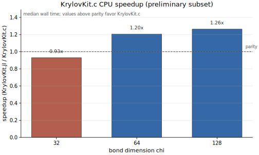
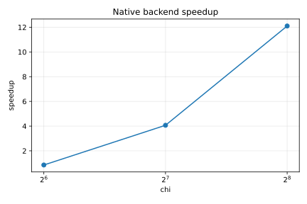
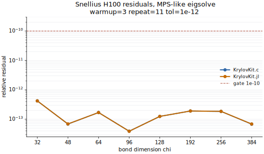
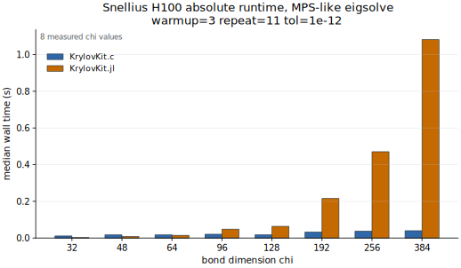

# KrylovKit.c

KrylovKit.c is a benchmark-first native Krylov backend for selected
KrylovKit-style eigensolver and linear-solver experiments. It is not a complete
replacement for KrylovKit.jl and should not be cited as the scientific source.
The release-facing Julia package lives in `KrylovKitC/`.

```julia
using Pkg
Pkg.add(url="https://github.com/qiyang-ustc/KrylovKit.c", subdir="KrylovKitC")
```

## Acknowledgement

KrylovKit.jl is the reference implementation and semantic baseline for this
work. We are grateful to Jutho Haegeman and the KrylovKit.jl contributors for
the API, documentation, and algorithmic design. If this backend is useful in
your work, please cite and acknowledge KrylovKit.jl by Jutho Haegeman and
contributors. If you use it through the TeneT.c tensor-network benchmarks,
please also cite and acknowledge TeneT.jl by Xingyu Zhang and contributors.

## What Is Measured

- `native_eigsolve` and `native_linsolve` wrappers over the native C++/CUDA core.
- CPU `Float64` and `ComplexF64` dense/callback correctness.
- CUDA `Float64` MPS-like two-layer fast path used by TeneT.c.
- KrylovKit.jl parity on the same generated MPS-like transfer problems.

Generic user callbacks are tested for correctness but are not advertised as
generally faster than KrylovKit.jl. The current headline workload is the
MPS-like fast path.

## Correctness Before Speed

The release gate covers dense real/complex oracle cases, Hermitian and
non-normal matrices, clustered/repeated eigenvalues, complex conjugate pairs,
Jordan-like defective cases, exact breakdown, nonconvergence,
`:LM/:SM/:LR/:SR/:LI/:SI` selectors, complex conjugate inner products, shifted
`a0+a1A` linsolve semantics, GMRES, CG, BiCGStab, zero RHS, and
ill-conditioned linsolve cases.

```sh
KRYLOVKITC_RUN_RELEASE_GATE=1 julia --project=KrylovKitC -e 'using Pkg; Pkg.test()'
```

Numerical gates:

- CPU residual: `<= 1e-12`
- H100 residual: `<= 1e-10`

## Performance Evidence

All README figures are generated from committed artifacts under
`benchmarks/results/`:

```sh
python3 benchmarks/plots/plot_release_figures.py
```

Current public artifacts are still partial. The expanded release suite targets
8 chi values per major curve; figures explicitly label partial coverage until
that data is present.









Detailed tables, run IDs, limitations, and reproduction commands are in
`KrylovKitC/README.md`.

## Expanded Release Sweep

```sh
bash benchmarks/run_release_suite.sh
```

Planned matrix:

- CPU Oblix: `chi=16,24,32,48,64,96,128,192`, warmup 2, repeat 9.
- H100 Snellius: `chi=32,48,64,96,128,192,256,384`, warmup 3, repeat 11.
- Tolerance: `1e-12`; Krylov dimension: `30`; maxiter: `100`.

No speedup claim is made for missing, timed-out, or smoke-test rows.
